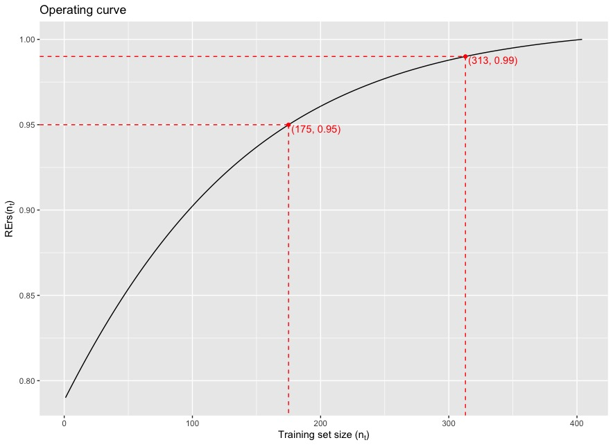

# R-Package: SSDFGP

<div style="text-align:center;">
Sample Size Determination for Genomic Prediction<br/><br/>


</div>

---

This R package provides a simple function to generate an operating curve that can be used for determining reasonable sample size for genomic prediction. Details are described in the published article by [Wu et al.](#)

## Installation

```R
### RUN THIS IN R ###
devtools::install_github("oumarkme/SSDFGP")
library(SSDFGP)
```

- Current version: v1.0.1
- Contact authors via the [GitHub issue page](https://github.com/oumarkme/SSDFGP/issues) or e-mails in the authorship list below if you have any questions.

## The `RErs.det()` function

Usage:

```R
RErs.det(geno, nt = NULL, n_iter = NULL, multi.threads = TRUE)
```

Input:

- `geno`: A numeric data frame. Genotype (or PCA) information. (rows: sample, columns: variants/PCs)
- `nt`: A numeric vector. Training set sizes for r-score simulation. Also known as $n_t$ in the article, which varies from $n_{min}$ to $n_{max}$ by increment of $\delta$ ($n_{min} \leq n_t \leq n_{max}$). This function will evenly determine 10 breakpoints by default (`nt = NULL`).

- `n_iter`: A number. Time of iteration of simulating r-scores for each given $n_t$. `n_iter = nt` by default (`n_iter = NULL`)
- `multi.threads`: TRUE/FALSE. This option controls whether or not use the

Output

- `$OC.fig`: Operating curve figure. Points which RErs($n_t$) equal 0.95 and 0.99 are annotated.

  

- `$GC.fig$`: Fitted growth curve and simulated points.
- `$parameter`: Estimated growth curve parameter ($\alpha$, $\beta$, and $\gamma$).
- `$OC.fit$`: The fitted values (RErs$(n_t)$) of the operating curve model. ($1 \leq n_t \leq n_c$).

## Example

Here we use rice 44k data as an example. The raw dataset is available at [ricediversity.org](http://www.ricediversity.org/data/sets/44kgwas/) and published by [Zhao et al. (2011)](https://doi.org/10.1038/ncomms1467). Load PCA matrix of the genotype data from the `TSDFGS` package.

```R
library(TSDFGS)
data(TSDFGS)
```

Run the `RErs.det()`function setting $n_t$ ranging from 25 to 225 by increacement of 25.

```R
RErs.det(geno, nt = seq(25, 225, by = 25))
```

## Authorship

- Po-Ya Wu ([Po-Ya.Wu@hhu.de](mailto:Po-Ya.Wu@hhu.de))
  - Article's first author.
  - Institute for Quantitative Genetics and Genomics of Plants, Heinrich Heine University, Düsseldorf, Germany
- Jen-Hsiang Ou ([jen-hsiang.ou@imbim.uu.se](mailto:jen-hsiang.ou@imbim.uu.se))
  - Package maintainer
  - Department of Medical Biochemistry and Microbiology, Uppsala University, Uppsala, Sweden
- Chen-Tuo Liao ([ctliao@ntu.edu.tw](mailto:ctliao@ntu.edu.tw))
  - Project administration, supervisor
  - Department of Agronomy, National Taiwan University, Taipei, Taiwan
